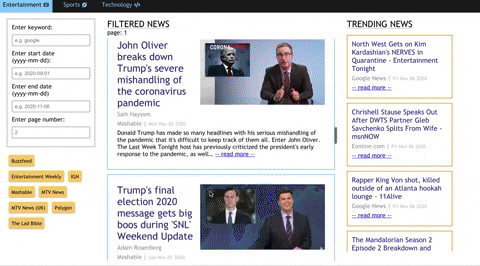

# QUICK NEWS

## Overview
The objective of this website is to create an interface for a user to navigate news
articles in the following categories: sports, entertainment, and technology. This
web app has a React frontend and makes http requests to [NewsApi](https://newsapi.org/)
in order to fetch news. You can view the published site [here](https://quicknews-ses.herokuapp.com/)

## Running this Project Locally
This project was created with create-react-app so setting it up locally is very easy.
Run `npm install` to install dependencies then run `npm start` to launch the web
app.

## Functionality

Users can filter news based on start and end dates and can specify keywords. Users
may also specifiy the results page number in order to see new results. Users may
also select news sources to filter by. The news source suggestions provided on the
left are selected by default but users may select or deselect sources. When no sources
are selected, 'FILTERED NEWS' displays articles related to the category, regardless
of source. The 'FILTERED NEWS' column is scrollable and is populated with news 
results from a specified page. The 'TRENDING NEWS' column displays the top news 
headlines for a certain category.

Users may navigate to articles by either clicking on the article or by clicking
on the '-- read more --' link of the article. 

Users may toggle to different categories using the top navigation bar.

## Identifying Articles with Paywalls

For this project, I provided a naive approach to flagging articles with paywalls.
I looked at commonly fetched news domains from NewsApi and navigated the domains,
storing domains with paywalls in a constants file. In my web app, when displaying
articles I checked whether they came from 'paywalled' sources and if so added
a little disclaimer (*may have paywall) to said articles.

This solution may have missed sites with paywalls and is not very scaleable so
given more time to work on this project, I would devise a way to scout out
articles before displaying them to the user. I could then scrape their site and search
for terms such as 'Subscription' and other related terms. I would then flag
certain articles as having paywalls. This solution may not be ideal because 
it may falsely flag some articles as having paywalls and may miss others. It
would also take extra time to do this scouting so my site could become slow
and laggy.

Another solution would be to create a backend and periodically run a 'scout' script
in order to classify paywalls. This may be unhelpful for users in scenarios where
they get a certain amount of visits to articles of a site before the paywall goes
up. They would then be dissuaded from reading articles they coould actually read
for free.

